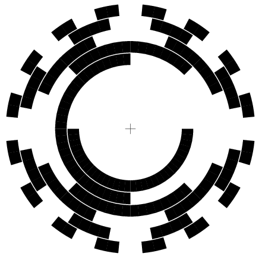

Little useful and silly PostScript hacks
----------------------------------------

PostScript is a programming language that allows to define highly precise, real
coordinate graphics, which I often use to directly print out geometric
accurate pieces.

This is a random collection of hacks that might be worthwhile
for others to use. Consider them (c) H.Zeller <h.zeller@acm.org>,
licensed Creative Commons BY-SA.

All of these typically have a configuration section at the top that allows
to modify the parameters. Just configure, verify in ghostscript and print
out. If your printer is properly calibrated, it should print this in the
exact measurements (beware certain PostScript -> PDF conversion with subsequent
PDF printing: these programs often attempt to be too smart for their own good
and scale the image to what they think the margins of the paper is. So make sure
to always set the margins to zero).

### Encoder wheel

#### Simple segmented
For rotational applications, it is often needed to keep track of the
turns. The [`encoder-wheel.ps`](./encoder-wheel.ps) is freely configurable in
radius and number of segments displayed.

Here configured for 12 steps with an inner radius of 20mm and an outer radius
of 30mm. The output also includes some helpful measurements:

![Image or encoder wheel][wheel-img]

#### Gray encoder

To measure absolute positions, you need a gray encoder wheel. The PostScript
file allows to choose the number of bits, inner and outer diameter.



### SMD ruler
If you're soldering a lot of SMD parts and need to check measurements or
count leads, the [`smd-ruler.ps`](./smd-ruler.ps) might be useful for you.

![Image of ruler][ruler-img]

### Metric/Imperial sizes
The [`metric-imperial-diameter.ps`](./metric-imperial-diameter.ps) creates
a chart to get a visual understanding about the relationship between metric
and imperial measurements and hole-sizes. Typically good to gauge drill sizes.

### Page Label
Just given a simple list of labels, create full-page labels that fit into
a rectangular space best, using the largest font-size possible. This is the
[`page-label.ps`](./page-label.ps) script.

Just append at the end of the PostScript page. For instance

```
%%Page:
(Goggles\nGloves) show-max

%%Page:
(Drills\nMills) show-max
```

.. creates these

![Page-labels][page-label]

### Box label
The [`box-label.ps`](./box-label.ps) script creates little labels for SMD boxes.
To be printed on blank sticker page. With a simple script addition appended
at the bottom like this:

```
{ (1.0) Ohm } box
{ (1.1) Ohm } box
{ (1.2) Ohm } box
% and so on
```

... the output is like:

![Box Label][box-label-img]

### Ascii Graphics from "Bob Neill's Book of Typewriter Art"

There were little Ascii graphics in the typewriter times. I got interested
when seeing
<a href="https://pbs.twimg.com/media/DrgVJYfXQAAgZ2f.jpg">this image
</a>

This program parses such instructions and prints them out.
You've to find the book to fully type all the instructions. I only got to
page 84-85, while there are pages 86..90 have yet to be typed in, so the
following image is incomplete.
(Gladly accepting pull requests... Just edit the PostScript file while
having it open in okular or similar that reloads whenever you save.)

![ASCII graphics][ascii-graphics]

### Mirror Reflection

Playing around with mirror reflection on curved surfaces described by a function and
its derivative.

![Parabolid reflection][mirror-reflection]

[box-label-img]: ./img/box-label.png
[wheel-img]: ./img/wheel-picture.png
[ruler-img]: ./img/smd-ruler.jpg
[page-label]: ./img/page-label.png
[ascii-graphics]: ./img/ascii-graphics.png
[mirror-reflection]: ./img/mirror-reflection.png
